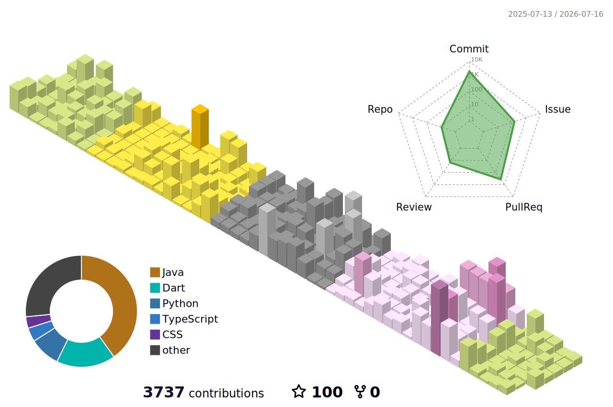

## 👋 About Me

NHN Dooray에서 백엔드를 개발하고 있는 이승구입니다.
Java / Kotlin / Spring 기반으로 서비스를 만들며, **대규모 시스템 설계 · 결제 시스템 · 검색**에 관심이 많습니다.
공부하고 경험한 것들은 블로그에 기록으로 남기고 있습니다.

---

## 🛠 Skills

<table>
  <tr>
    <th align="left">BackEnd</th>
    <td>
      
      
      
      
      
      
      
      
      
      
      
      
      
      
      
    </td>
  </tr>
  <tr>
    <th align="left">FrontEnd</th>
    <td>
      
      
      
    </td>
  </tr>
  <tr>
    <th align="left">DevOps</th>
    <td>
      
      
      
      
      
      
      
    </td>
  </tr>
</table>

---

## 📝 Latest Blog Posts

<!-- BLOG-POST-LIST:START -->- [5편 &mdash; 결과와 교훈: dev k6 측정의 진실](https://leesg107.tistory.com/169) · 2026-04-30 
- [4편 &mdash; 두 번의 AI 코드 리뷰가 잡아낸 진짜 결함](https://leesg107.tistory.com/168) · 2026-04-30 
- [3편 &mdash; Spring Security OAuth2 마이그레이션: 왜 표준이 답인가](https://leesg107.tistory.com/167) · 2026-04-30 
- [2편 &mdash; 임시 처방의 한계: 캐시와 retry 의 진실](https://leesg107.tistory.com/166) · 2026-04-30 
- [1편 &mdash; 5년 묵은 401 의 정체: 진단의 함정](https://leesg107.tistory.com/165) · 2026-04-30 
<!-- BLOG-POST-LIST:END -->

---

## 🌱 My Contributes

---

## 📊 My Status

---

## 💯 BackJun

## Github

