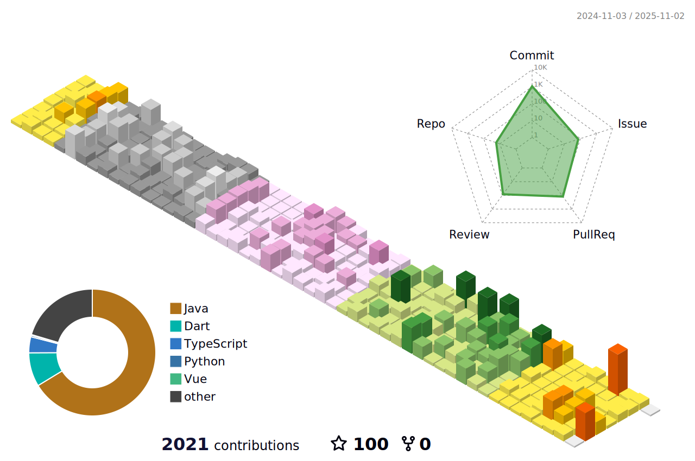

## Skills

  
BackEnd

  

    
    
    
    
    
    
    
    
    
    
    
    
  

  
  
FrontEnd

  

    
    
    
  

  
DevOps

  

    
    
    
    
    
    
    
  

--- 

## My Status

--- 

<!--## My Language
 -->
  
  
## BackJun

  

## Github

    
